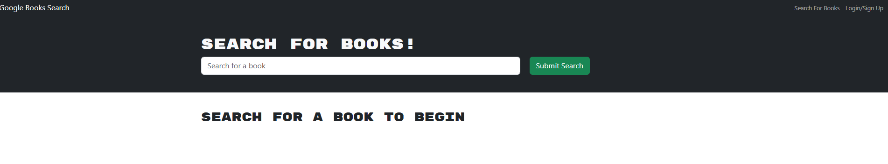
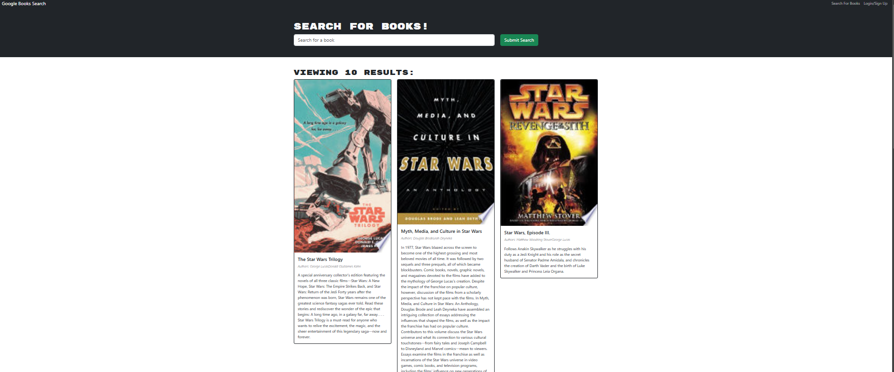
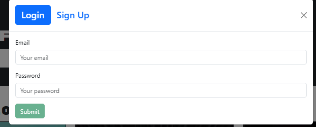
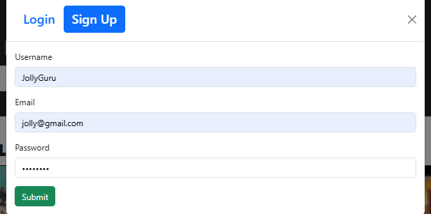

  # Title
   BookFinder
   

  ## Table of Contents

  - [Description](#description)
  - [Design](#design)
  - [Install](#install)
  - [Contributor](#contributor)
  - [License](#license)
  - [Questions](#questions)

  ## Description

   A user can search for books. Once logged in they can save a book or delete a book.

  ## Design

    To keep track of books I enjoy.

  ## Install

    npm run develop

  ## Contributor

    Class starter files, google, mvoidets

  ## License

    This is not licensed  

  ### Questions

  If you have any questions, please contact me at: [mvoidets@yahoo.com] (mailto:mvoidets@yahoo.com). 

  My GitHub profile is [mvoidets](https://guthub.com/mvoidets).

  Thank you for visiting my repository!